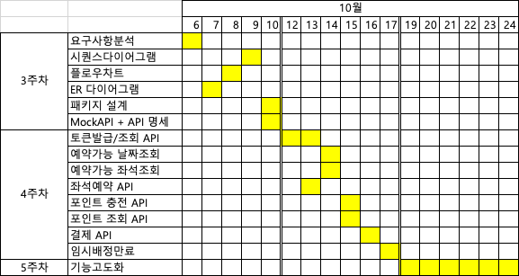

# 항해 플러스 6기 - 콘서트 예약 서비스

## 시나리오 선정이유
1. 콘서트 및 공연을 좋아합니다.
2. 레디스를 경험해볼 수 있을 것 같았습니다.

 

## 요구사항 분석
#### 최소한의 구현을 위한 기본가정
> **콘서트 예약**이라는 건 보통 인터파크 티켓, Yes24 티켓, 멜론티켓 등 티켓팅 사이트에서 주로 경험하게 됩니다.  
> 그런 사이트들은 티켓거래를 중개해주는 큰 규모의 서비스이므로 공연장의 정보, 공연자의 정보, 공연의 스케줄, 선예매시스템, 취소후재예매 시스템 등을 제공합니다.   
> 이는 과제에서 요구하는 것보다 복잡한 설계를 요구하게 됩니다.   
> 저는 구현의 편의성을 위해 위 사이트들을 참고하되 아래와 같은 기본가정을 두어 조금 더 간소화된 서비스를 설계했습니다.

1. 이 서비스는 `어느 특정 공연장`에서 열리는 콘서트 및 공연들에 대한 예약 서비스이다. (따라서 공연장의 정보에 대한 테이블은 불필요)
2. 이 공연장에서는 어떤 공연이 진행되는지는 중요하지 않다. 그저 어떤 날짜에 공연이 열리는지가 중요하다. (공연기본정보 - 공연자명, 러닝타임, 예매오픈일 등 관련한 테이블은 불필요하다. 공연일, 공연시작시간에 관한 정보만 있으면 된다.)  
또한, 하나의 공연이 여러일자에 열리는 것을 굳이 고려하지 않는다. (공연명, 공연일, 공연시작시간은 같은 테이블에 둔다.)
3. 열리는 공연들의 생성은 중요하지 않다. 물리적으로 불가능하더라도 같은일시에 공연이 있는 것을 제한두지 않는다. 
4. 이 공연장의 좌석은 1~50으로 넘버링 되어 있으며, 공연마다 좌석이 배정된다. (공연당 좌석에 대한 정보 필요)

### API Specs 요구사항 상세분석자료 링크
1. [요구사항 분석](docs/requirements.md)
2. [플로우 차트](docs/flowcharts.md)
3. [시퀀스다이어그램](docs/sequence.md)

 

## 마일스톤

