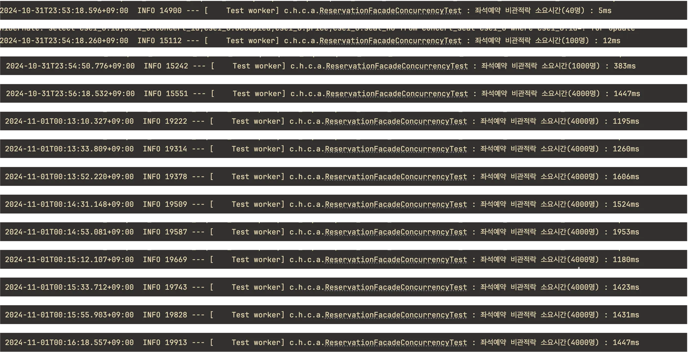
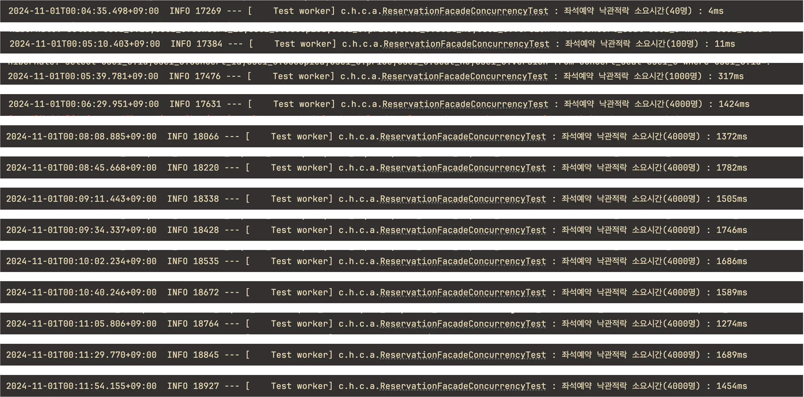
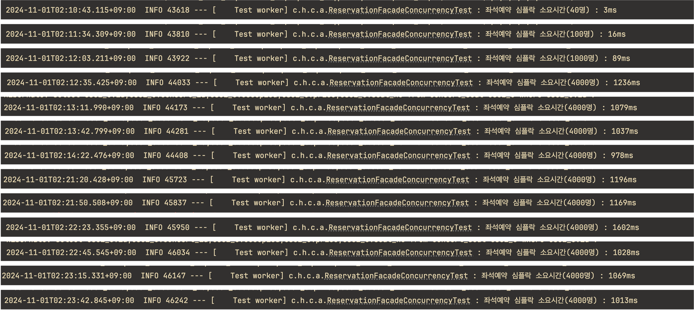

# 콘서트 예약서비스 동시성 이슈 및 제어방식

## 동시성 제어방식 정리
### [ 비관적락 ]
- DB에서 한 자원을 획득하려고 할때, 한 트랜잭션이 락을 획득하면, 다른 트랜잭션은 락 획득할때까지 `대기`한다.
    - 따라서 **순차적인 처리**가 가능하다.
- 그러나 한 트랜잭션의 작업 처리 시간이 길어지면, Timeout에러가 날 가능성이 높아진다.
- 또한 공유하는 자원이 각각 비관적락이 걸린 경우 데드락이 생길 가능성이 있다.

### [ 낙관적락 ]
- `version`컬럼을 통해 동시성을 제어하는 방식.
- 각각의 트랜잭션이 동시에 한 row에 접근할 수 있으나, 커밋 시 version 정보를 확인하여 version이 일치하지 않는 경우 에러가 발생한다.
- 이 에러는 어플리케이션 단에서 처리를 해준다.
- 충돌이 많은 경우에는 권장되지 않는다. 
  - ex. 하나의 자원에 대한 락획득 시도가 1000건이 동시에 일어나는 경우, 1건만 성공하고 나머지 999건은 리트라이를 시도해야 한다. 이 과정에서 DB 에 요청을 해야하는 건이 많아지므로 성능상 좋지 않다.
  - 따라서 **충돌이 적은 경우** 혹은 **리트라이로직이 불필요**할 때만 고려해봄직하다.

### [ 분산락(Redis) ]
- 락의 구현을 DB에서 하는 것이 아닌 외부 인프라에 둔다. 
  - 따라서 분산환경에서 동시성 제어가 가능하다.
  - DB부하도 낮출 수 있다.
- 레디스 인프라 관련 관리가 추가적으로 필요하다.(ex. 레디스 서버가 죽는 경우 대비 등)
- Redis : Remote Dictionary Server
  - 특징
    - 외부에 key-value 타입으로 데이터를 저장하도록 지원한다.
    - 인메모리 DB로 속도가 빠르다.
    - 싱글스레드 방식이다.
  - 레디스로 구현가능한 락의 종류 및 라이브러리
    - Simple Lock : key 선점에 의한 lock 획득 실패 시, 비즈니스 로직을 수행하지 않음
    - Spin Lock : lock 획득 실패 시, 일정 시간/횟수 동안 Lock 획득을 재시도, Lettuce
    - Pub/Sub : redis pub/sub 구독 기능을 이용해 lock 을 제어, Redisson

### [ 정리 ]

| 분류       | 장점            | 단점              | 구현난이도(나에게) |
|----------|---------------|-----------------|------------|
| 비관적락     | 순차처리          | 대기 > timeout, 데드락 | 낮음         |
| 낙관적락     | 대기x           | 충돌이 많은 경우 성능 저하 | 낮음         |
| 분산락(레디스) | 분산환경, 처리속도 빠름 | 추가적인 관리 필요      | 익숙하지않음..   |

## 동시성 이슈 케이스 정리
### [ 포인트 충전 ]
1. 시나리오
   - 사용자가 의도한 모든 충전은 정상적으로 충전이 되어야 한다. 그러나 사용자의 "따닥"이슈 등 실수로 api가 동시에 호출이 되는 경우는 충전이 한 번만 될 수 있도록 제어가 필요하다.

2. 구현할 락: **낙관적락**
   - 포인트 충전이 동시에 발생하는 건수는 그리 많지 않을 것이다. 따라서 재시도를 하지 않게 구현한 낙관적락이 적합해 보인다.
   - 비관적락의 경우는 대기 후 타임아웃이 나지 않는 이상 충전이 그대로 되어버릴 것이기 때문에 적합하지 않다고 생각한다.
   
### [ 포인트 차감 ]
1. 시나리오
   - 포인트의 차감은 정확한 `잔액`을 산출하기 위해 `순차적`으로 이루어져야 한다.
     - ex) 포인트 잔액이 100,000원인 사용자가 30,000원 차감을 동시에 5번 시도할 경우, 3번째 시도까지는 성공적으로 잔액을 차감하고 4번째 시도부터는 잔액부족오류가 나야한다.
     - 동시성 제어가 되지 않는 경우 잔액의 업데이트가 동시에 이루어져 정확한 잔액을 남기지 못할 가능성이 있다.

2. 구현할 락: **비관적락**
   - 포인트 차감은 `순차적`으로 실행되는 것이 중요하므로 락이 걸린 경우 `대기`하는 비관적락이 적합하다.
   - 포인트 차감의 동시적 발생은 한명의 유저로인해 발생하는 것이므로 발생가능성이 낮다. 따라서 분산락으로의 구현은 오버엔지니어링이라고 생각한다.
   
### [ 좌석예약 ]
1. 시나리오
   - 여러명의 사용자가 하나의 좌석에 대해 동시에 예약을 시도하는 경우 한명만 예약에 성공한다.
   - 락 획득에 실패한 사용자에 대한 재시도는 필요하지 않고 빠르게 에러를 응답해주어야 한다.
     - 재시도가 필요 없다고 생각하는 이유: 첫 락을 획득한 사용자가 대부분 좌석예약에 성공할 것이고, 이외의 사용자들은 빠르게 에러(이선좌)를 리턴받고 다른 좋은 자리를 노릴 수 있게 해야한다고 생각한다.
   - 인기가 많은 좌석에 대해서는 충돌 발생 가능성이 높다.

2. 락 성능 비교(처리 소요시간 기준)
    - **비관적락** - 40명: 5ms / 100명: 12ms / 1,000명: 383ms / 4,000명 10번 평균: 1,446.6ms
   
   - **낙관적락** - 40명: 4ms / 100명: 11ms / 1,000명: 317ms / 4,000명 10번 평균: 1,552.1ms  
   
   - Redis : Simple Lock - 40명: 3ms / 100명: 16ms / 1,000명: 89ms / 4,000명 10번 평균: 1,140.7ms
   
   - Redis : Spin Lock, Pub/Sub 방식은 이 시나리오에서는 재시도가 필요하지 않다고 생각하여 테스트하지 않았습니다.

3. 구현할 락: **Redis Simple Lock**
   - 좌석예약은 인기 좌석에 대해서는 충돌가능성이 높습니다. 따라서 DB의 부하를 줄이고, 전체 처리소요시간을 줄이기 위해 Redis Simple Lock을 사용해서 구현하고자 합니다.

### [ 정리 ]
|이슈|구현|키워드|
|--|--|--|
|포인트충전|낙관적락|재시도x|
|포인트차감|비관적락|순차처리|
|좌석예약|레디스심플락|대량충돌,재시도x|

