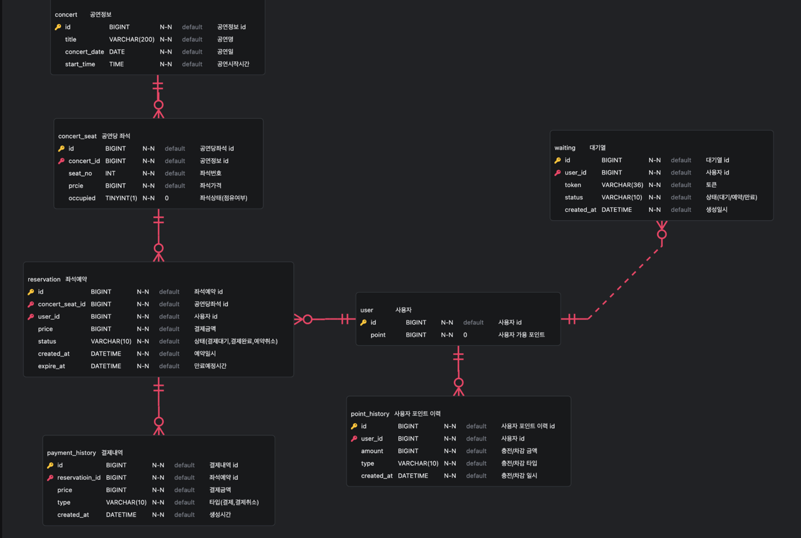

### ERD

#### 공연 도메인
- 공연정보 테이블(concert)
   - 공연명 및 공연스케줄 관련 정보
- 공연당 좌석 테이블(concert_seat)
   - 공연마다 열리는 좌석 정보
   - occupied 컬럼으로 좌석의 점유여부 판단.
---
#### 예약 도메인
- 좌석예약(reservation)
   - 사용자의 좌석예약정보 
   - 결제금액, 결제상태 등 결제정보 포함
   - 예약일시, 만료예정시간 등 예약 관련 정보 포함.
- 결제내역(payment_history)
   - 좌석예약에 대한 결제내역(이력)
---
#### 사용자 도메인
- 사용자(user)
   - 사용자 및 사용자의 포인트 정보 포함
- 사용자 포인트 이력(point_history)
   - 사용자 포인트 충전/차감 이력 
---
#### 대기열 도메인
- 대기열(waiting) 

### DDL
``` sql
# 공연정보 테이블
create table `concert` (
    `id` bigint primary key auto_increment comment '공연정보 id',
    `title` varchar(200) comment '공연명',
    `concert_date` date not null comment '공연일',
    `start_time` time not null comment '공연시작시간'
) comment '공연정보 테이블';

# 공연당 좌석 테이블
create table `concert_seat`(
    `id` bigint  primary key auto_increment comment '공연당좌석 id',
    `concert_id` bigint not null comment '공연정보 id',
    `seat_no` int not null comment '좌석번호',
    `price` bigint not null comment '좌석가격',
    `occupied` tinyint(1) not null default 0 comment '좌석상태(점유여부)',
    foreign key (concert_id) references `concert` (id),
    unique key unique_concert_seat (concert_id, seat_no)
) comment '공연당 좌석 테이블';

# 사용자 테이블
create table `user`(
    `id` bigint primary key auto_increment comment '사용자 id',
    `point` bigint not null default 0 comment '사용자 가용포인트'
) comment '사용자 테이블';

# 좌석예약 테이블
create table `reservation` (
    `id` bigint primary key auto_increment comment '좌석예약 id',
    `concert_seat_id` bigint not null comment '공연당좌석 id',
    `user_id` bigint not null comment '사용자 id',
    `price` bigint not null comment '결제금액',
    `status` varchar(10) not null comment '결제상태(결제대기,결제완료,결제취소)',
    `created_at` datetime not null comment '예약일시',
    `expire_at` datetime not null comment '만료예정시간',
    foreign key (concert_seat_id) references `concert_seat` (id),
    foreign key (user_id) references `user` (id)
) comment '좌석예약 테이블';

# 결제내역
create table `payment_history` (
    `id` bigint primary key auto_increment comment '결제내역 id',
    `reservation_id` bigint not null comment '좌석예약 id',
    `price` bigint not null comment '결제금액',
    `type` varchar(10) not null comment '타입(결제,취소)',
    `create_at` datetime not null comment '생성일시',
    foreign key (reservation_id) references `reservation` (id)
) comment '결제내역';

# 대기열
create table `waiting` (
    `id` bigint primary key auto_increment comment '대기열 id',
    `user_id` bigint not null comment '사용자 id',
    `token` varchar(36) not null comment '사용자 토큰(UUID)',
    `status` varchar(10) not null comment '상태(대기,예약,만료)',
    `created_at` datetime not null comment '생성일시',
    `updated_at` datetime not null comment '상태변경일시',
    unique key unique_token (token),
    foreign key (user_id) references `user` (id)
) comment '대기열 테이블';

# 사용자 포인트 이력
create table `point_history` (
    `id` bigint primary key auto_increment comment '사용자 포인트 이력 id',
    `user_id` bigint not null comment '사용자 id',
    `amount` bigint not null comment '충전/차감 금액',
    `type` varchar(10) not null comment '충전/차감 타입',
    `created_at` datetime not null comment '충전/차감 일시',
    foreign key (user_id) references `user` (id)
) comment '사용자 포인트 이력';
```
