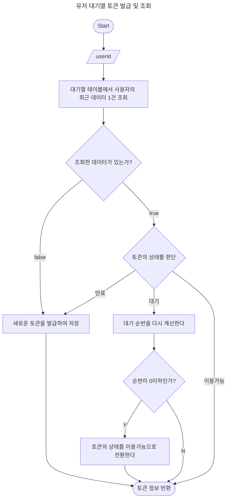
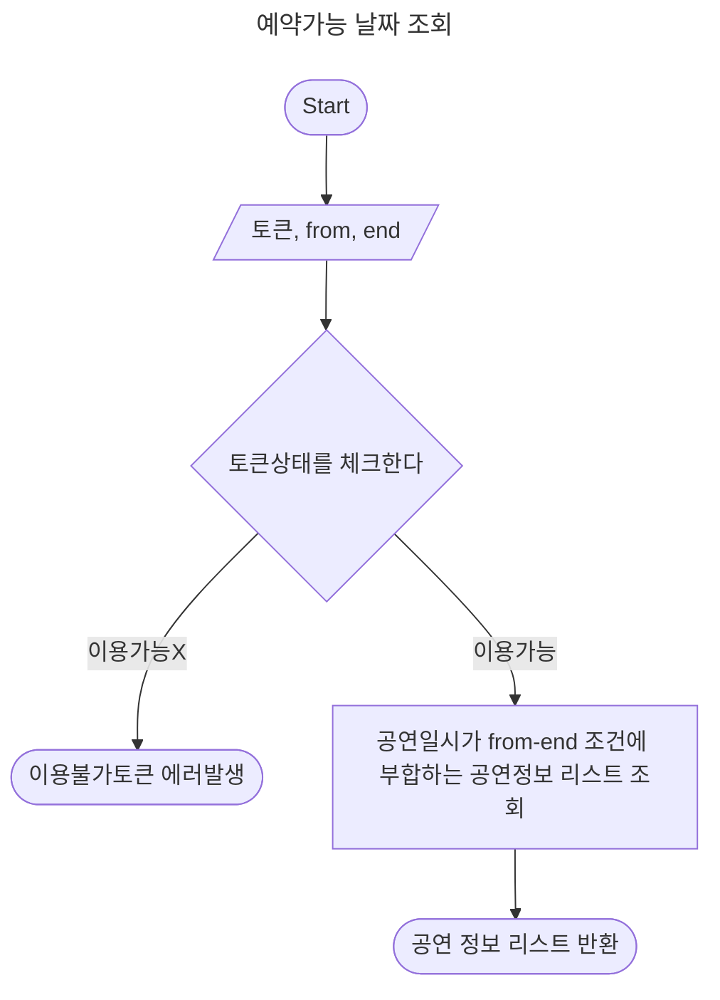
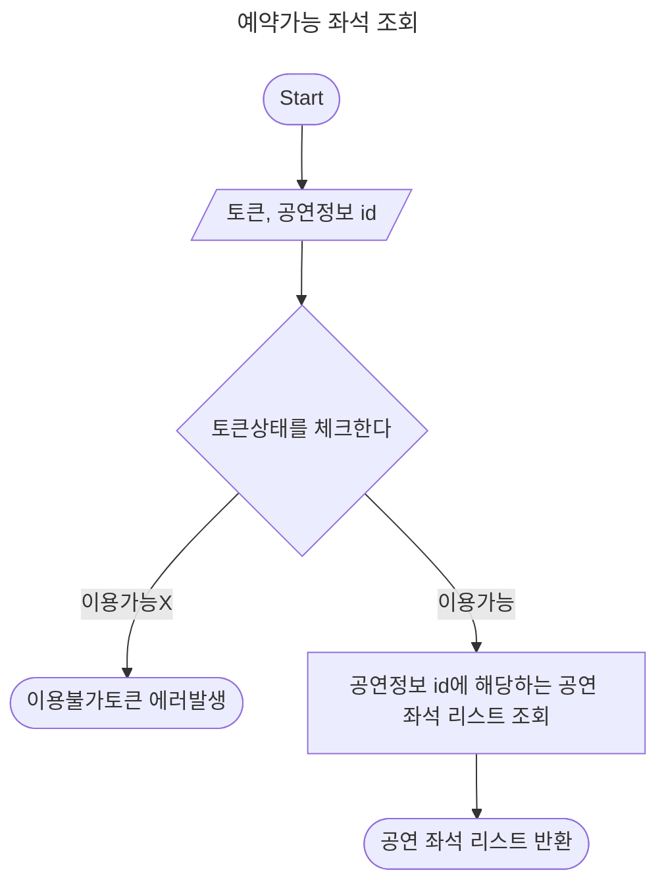
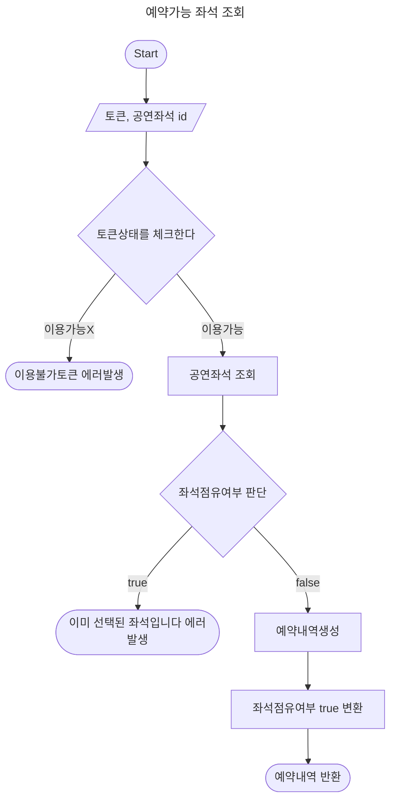
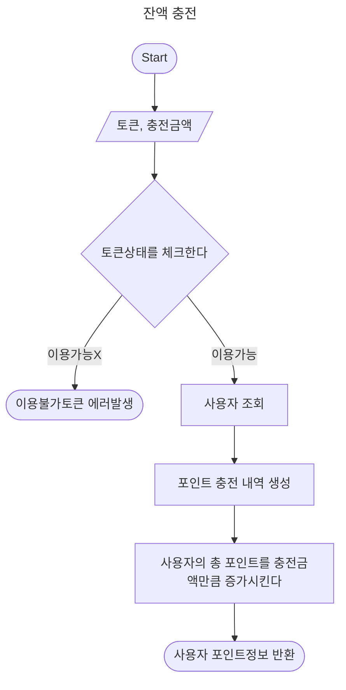
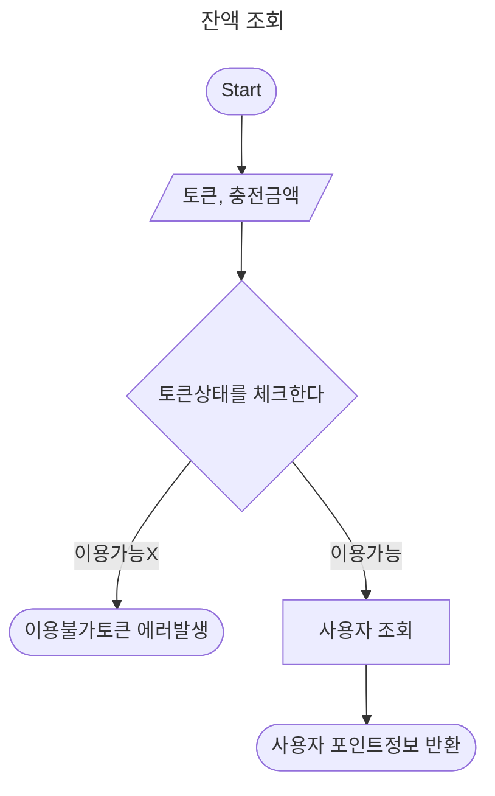
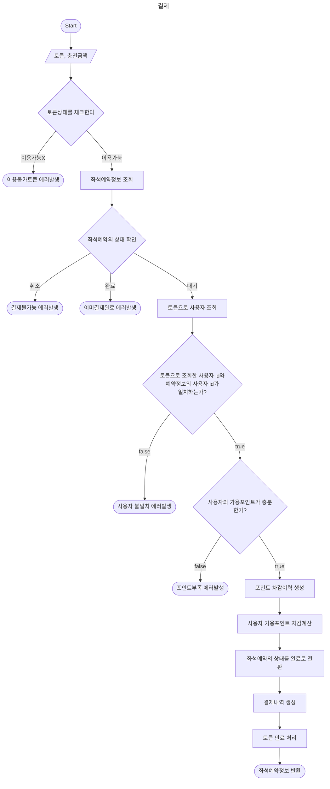
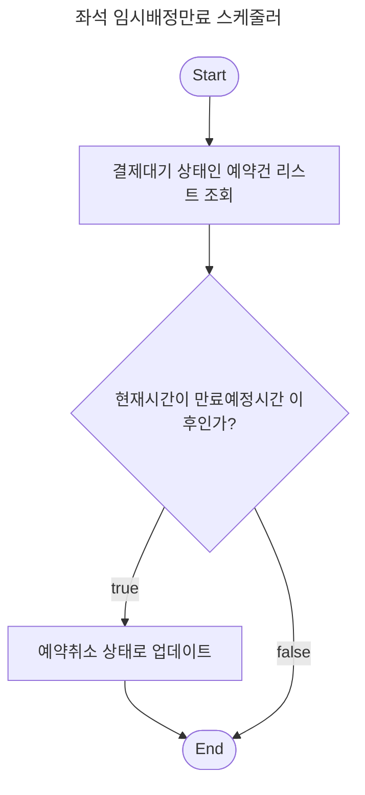

### 플로우 차트

#### 유저 대기열 토큰 기능

```mermaid
---
title: 유저 대기열 토큰 발급 및 조회
---
flowchart TD
    Start([Start])
    Request[/userId/]
    FindWaitingInfo[대기열 테이블에서 사용자의 최근 데이터 1건 조회]
    Cond1{조회한 데이터가 있는가?}
    NewToken[새로운 토큰을 발급하여 저장]
    JudgeStatus{토큰의 상태를 판단}
    CalculateOrder[대기 순번을 다시 계산한다]
    Cond2{순번이 0이하인가?}
    ChangeStatus[토큰의 상태를 이용가능으로 전환한다]
    Return([토큰 정보 반환])
    
    Start-->Request-->FindWaitingInfo-->Cond1
    Cond1--false-->NewToken-->Return
    Cond1--true-->JudgeStatus
    JudgeStatus--대기-->CalculateOrder-->Cond2
    Cond2--Y-->ChangeStatus-->Return
    Cond2--N-->Return
    JudgeStatus--이용가능-->Return
    JudgeStatus--만료-->NewToken
    Return
```

#### 예약가능 날짜 조회

```mermaid
---
title: 예약가능 날짜 조회
---
flowchart TD
    Start([Start])
    Request[/토큰, from, end/]
    CheckToken{토큰상태를 체크한다}
    TokenUnavailable([이용불가토큰 에러발생])
    TokenAvailable[공연일시가 from-end 조건에 부합하는 공연정보 리스트 조회]
    Return([공연 정보 리스트 반환])
    
    Start-->Request-->CheckToken
    CheckToken--이용가능X-->TokenUnavailable
    CheckToken--이용가능-->TokenAvailable-->Return
```

#### 예약가능 좌석 조회

```mermaid
---
title: 예약가능 좌석 조회
---
flowchart TD
    Start([Start])
    Request[/토큰, 공연정보 id/]
    CheckToken{토큰상태를 체크한다}
    TokenUnavailable([이용불가토큰 에러발생])
    TokenAvailable[공연정보 id에 해당하는 공연 좌석 리스트 조회]
    Return([공연 좌석 리스트 반환])
    
    Start-->Request-->CheckToken
    CheckToken--이용가능X-->TokenUnavailable
    CheckToken--이용가능-->TokenAvailable-->Return
```

#### 좌석 예약 요청

```mermaid
---
title: 예약가능 좌석 조회
---
flowchart TD
    Start([Start])
    Request[/토큰, 공연좌석 id/]
    CheckToken{토큰상태를 체크한다}
    TokenUnavailable([이용불가토큰 에러발생])
    TokenAvailable[공연좌석 조회]
    CheckOccupied{좌석점유여부 판단}
    OccupiedY([이미 선택된 좌석입니다 에러발생])
    CreateReservation[예약내역생성]
    ChangeOccupied[좌석점유여부 true 변환]
    Return([예약내역 반환])

    Start-->Request-->CheckToken
    CheckToken--이용가능X-->TokenUnavailable
    CheckToken--이용가능-->TokenAvailable-->CheckOccupied
    CheckOccupied--true-->OccupiedY
    CheckOccupied--false-->CreateReservation-->ChangeOccupied-->Return
```

#### 잔액 충전

```mermaid
---
title: 잔액 충전
---
flowchart TD
    Start([Start])
    Request[/토큰, 충전금액/]
    CheckToken{토큰상태를 체크한다}
    TokenUnavailable([이용불가토큰 에러발생])
    TokenAvailable[사용자 조회]
    NewPointHistory[포인트 충전 내역 생성]
    CalculateUserPoint[사용자의 총 포인트를 충전금액만큼 증가시킨다]
    Return([사용자 포인트정보 반환])
    
    Start-->Request-->CheckToken
    CheckToken--이용가능X-->TokenUnavailable
    CheckToken--이용가능-->TokenAvailable-->NewPointHistory-->CalculateUserPoint-->Return
```

#### 잔액 조회

```mermaid
---
title: 잔액 조회
---
flowchart TD
    Start([Start])
    Request[/토큰, 충전금액/]
    CheckToken{토큰상태를 체크한다}
    TokenUnavailable([이용불가토큰 에러발생])
    TokenAvailable[사용자 조회]
    Return([사용자 포인트정보 반환])

    Start-->Request-->CheckToken
    CheckToken--이용가능X-->TokenUnavailable
    CheckToken--이용가능-->TokenAvailable-->Return
```

#### 결제

```mermaid
---
title: 결제
---
flowchart TD
    Start([Start])
    Request[/토큰, 충전금액/]
    CheckToken{토큰상태를 체크한다}
    TokenUnavailable([이용불가토큰 에러발생])
    TokenAvailable[좌석예약정보 조회]
    CheckReservationStatus{좌석예약의 상태 확인}
    Canceled([결제불가능 에러발생])
    Completed([이미결제완료 에러발생])
    UserByToken[토큰으로 사용자 조회]
    CheckUser{토큰으로 조회한 사용자 id와\n예약정보의 사용자 id가\n일치하는가?}
    NoAuth([사용자 불일치 에러발생])
    CheckPoint{사용자의 가용포인트가 충분한가?}
    NoPoint([포인트부족 에러발생])
    NewPointHistory[포인트 차감이력 생성]
    CalculateUserPoint[사용자 가용포인트 차감계산]
    ChangeReservationStatus[좌석예약의 상태를 완료로 전환]
    NewPaymentHistory[결제내역 생성]
    ExpireToken[토큰 만료 처리]
    Return([좌석예약정보 반환])

    Start-->Request-->CheckToken
    CheckToken--이용가능X-->TokenUnavailable
    CheckToken--이용가능-->TokenAvailable-->CheckReservationStatus
    CheckReservationStatus--취소-->Canceled
    CheckReservationStatus--완료-->Completed
    CheckReservationStatus--대기-->UserByToken-->CheckUser
    CheckUser--false-->NoAuth
    CheckUser--true-->CheckPoint
    CheckPoint--false-->NoPoint
    CheckPoint--true-->NewPointHistory-->CalculateUserPoint-->ChangeReservationStatus-->NewPaymentHistory-->ExpireToken-->Return
```

#### 좌석 임시배정만료 스케줄러

```mermaid
---
title: 좌석 임시배정만료 스케줄러
---
flowchart TD
    Start([Start])
    FindNotPayedReservation[결제대기 상태인 예약건 리스트 조회]
    
    CheckExpired{현재시간이 만료예정시간 이후인가?}
    ExpireReservation[예약취소 상태로 업데이트]
    End([End])
    
    Start-->FindNotPayedReservation-->CheckExpired
    CheckExpired--true-->ExpireReservation-->End
    CheckExpired--false-->End
```
