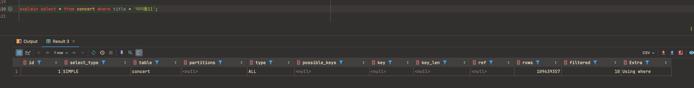
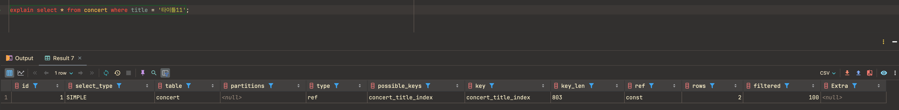
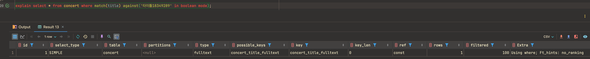
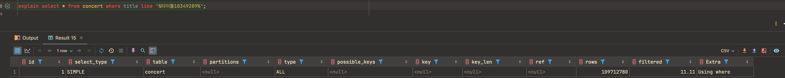

# 인덱스
### 인덱스란
- 인덱스는 조회성능의 향상을 위한 것이다. 대신 데이터의 저장(CUD) 성능을 희생한다. 
- **정렬**: 인덱스에 해당하는 컬럼과 해당하는 값을 따로 저장해두고 정렬해두어 데이터를 찾아보기 쉽게 한다. 그러나 CUD시 다시 재정렬이 필요하므로 고려가 필요하다.
- **카디널리티**: 데이터의 중복도. 카디널리티가 높다 = 중복이 적다.
- 인덱스 설정에는 정답이 없다. 변해가는 상황에 맞추어 설계가 필요하다. 
  - 어떻게 하면 적은 인덱스로, 정렬을 멋지게 잘해서, where 조건을 걸었을 때 탐색의 시간을 줄일 수 있을지 고려가 필요할 듯하다.(제 머릿속에서 정리된 느낌입니다.) 
  - 또한 데이터 삽입/수정은 적게 일어나고 조회에서 많이 이용되는 컬럼인지 고려해야한다.
- B-Tree 알고리즘이 일반적으로 사용된다. 
  - 100%일치 혹은 값의 앞부분만 일치하는 경우에 사용할 수 있다. 
  ```sql
  -- 100%일치
  select * from concert where title = '타이틀';
  
  -- 값의 앞부분만 일치
  select * from concert where title like '타%';
    
  -- 키 값의 뒷부분만 검색하는 용도로 사용 불가
  select * from concert where title like '%이틀'; -- X 
  ```
  - 인덱스의 키 값에 변형이 가해진 후 비교는 불가능하다.(B-Tree의 빠른 검색 불가)

<Br/>

### 콘서트 시나리오에서 인덱스 적용점
#### [ 콘서트명 검색 ] 
- api 구현은 없으나 사용자가 콘서트명을 검색하는 시나리오는 있을 수 있다.
1. 콘서트 데이터 세팅 - 프로시저로 데이터 insert
```sql
create procedure INSERT_CONCERT()
BEGIN
    DECLARE i INT DEFAULT 4;

    WHILE i <= 30000000 do
            insert into concert (title, concert_date, start_time) values (concat('타이틀',i), DATE_ADD(now(), INTERVAL FLOOR(RAND() * 365) DAY), '20:00:00');
            set i = i+1;
        end while;
end;

call INSERT_CONCERT(); -- 2~3번 돌림
```
- 콘서트 테이블 데이터 개수 (109,999,994개)


2. 일치검색 인덱스 비교 
   1) 인덱스 없는 경우 - 조회시간 약 26s, 
        
    explain
    
   2) 인덱스 적용 후 - 조회시간 약 56ms, 굉장한 성능향상
    
    explain
    

3. 완전일치 검색의 경우 인덱스 설정 시 조회쿼리의 성능향상을 확인하였다. 그러나 대부분의 `공연명`검색은 전체 일치 검색이 아닌 like 검색이 들어갈 것이므로 `title` 컬럼에 거는 인덱스의 효용성에는 의문이 든다.
- 대안 : FullText Index?
    1) 인덱스 없는 경우 - 조회시간 약 34s
    
    explain
    
    2) FullText Index 적용 - 조회시간 약 108ms
    
    explain
    
    3) 하지만 숫자로만 이루어진 문자열을 조회시 제대로 조회가 되지 않았다.
      
  
- 이렇게 데이터가 많다면 elastic search 도입을 고려하는게 낫지않을까 싶다...

#### [ 콘서트 좌석조회 ]
