# 인덱스
## 인덱스란
- 인덱스는 조회성능의 향상을 위한 것이다. 대신 데이터의 저장(CUD) 성능을 희생한다. 
- **정렬**: 인덱스에 해당하는 컬럼과 해당하는 값을 따로 저장해두고 정렬해두어 데이터를 찾아보기 쉽게 한다. 그러나 삽입/수정 시 다시 재정렬이 필요하므로 고려가 필요하다.
- **카디널리티**: 데이터의 중복도. 카디널리티가 높다 = 중복이 적다.
- 인덱스 설정에는 정답이 없다. 변해가는 상황에 맞추어 설계가 필요하다. 
  - 어떻게 하면 적은 인덱스로, 정렬을 멋지게 잘해서, where 조건을 걸었을 때 탐색의 시간을 줄일 수 있을지 고려가 필요할 듯하다.(제 머릿속에서 정리된 느낌입니다.) 
  - 또한 데이터 삽입/수정은 적게 일어나고 조회에서 많이 이용되는 컬럼인지 고려해야한다.
- B-Tree 알고리즘이 일반적으로 사용된다. 
  - 100%일치 혹은 값의 앞부분만 일치하는 경우에 사용할 수 있다. 
  ```sql
  -- 100%일치
  select * from concert where title = '타이틀'; -- O
  
  -- 값의 앞부분만 일치
  select * from concert where title like '타%'; -- O
    
  -- 키 값의 뒷부분만 검색하는 용도로 사용 불가
  select * from concert where title like '%이틀'; -- X 
  ```
  - 인덱스의 키 값에 변형이 가해진 후 비교는 불가능하다.(B-Tree의 빠른 검색 불가)

<Br/>

## 콘서트 시나리오에서 인덱스 적용점
### [ 콘서트명 검색 ] 
- api 구현은 없으나 사용자가 콘서트명을 검색하는 시나리오는 있을 수 있다. 
#### 1. 콘서트 데이터 세팅
- 콘서트 테이블 데이터 개수 (109,999,994개)


#### 2. 일치검색 인덱스 비교 
   1) 인덱스 없는 경우  
    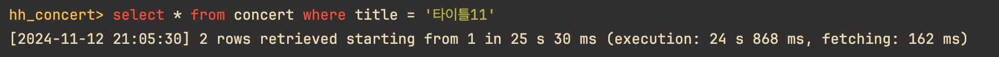
    explain analyze - actual time 약 34s
    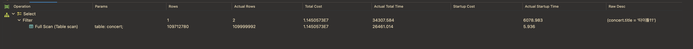
   2) 인덱스 적용 후
    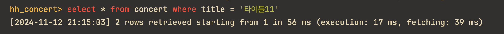
    explain analyze - actual time 약 0.3ms
    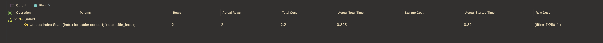

#### 3. like 검색? 
- 완전일치 검색의 경우 인덱스 설정 시 조회쿼리의 성능향상을 확인하였다. 그러나 대부분의 `공연명`검색은 전체 일치 검색이 아닌 like 검색이 들어갈 것이므로 `title` 컬럼에 거는 인덱스의 효용성에는 의문이 든다.
- 대안 : FullText Index?
    1) 인덱스 없는 경우 
    
    explain analyze - actual time 약 41s
    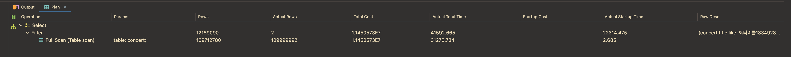
    2) FullText Index 적용 
    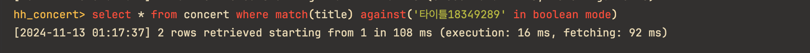
    explain analyze - actual time 약 2.7ms
    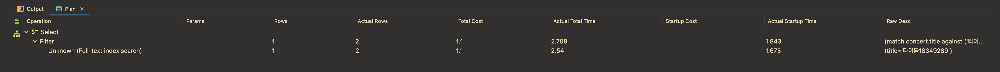
    3) 하지만 숫자로만 이루어진 문자열을 조회시 제대로 조회가 되지 않았다.
    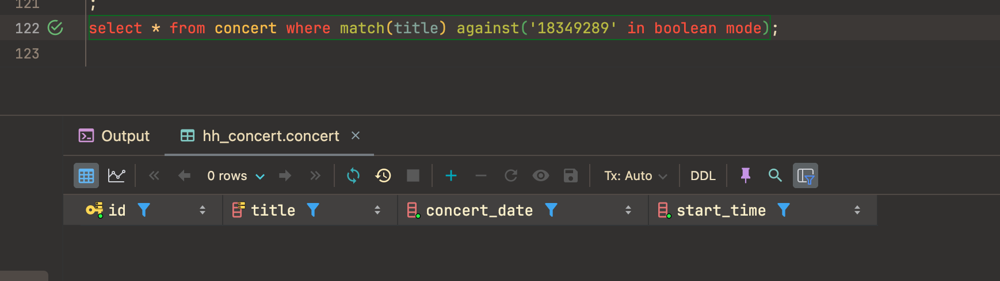  
  
- like 검색을 한다면 인덱스보다는 다른 개선방안을 생각해보는게 좋을 것 같다. 

<br/>

### [ 콘서트 좌석조회 ]
- 각 콘서트 별 좌석을 조회하는 시나리오.
#### 1. 데이터 세팅 
  - 콘서트당 2000석 규모 * 콘서트 5000개 insert : 좌석 데이터 수 (10,000,000개)

#### 2. 단일 인덱스 
- concert_id로 좌석조회 시  
- 인덱스가 없는 경우 
   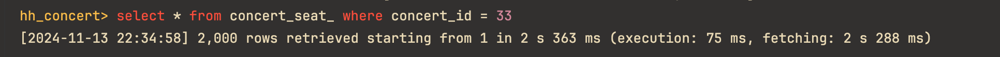
   explain analyze - actual time 약 2.4s
    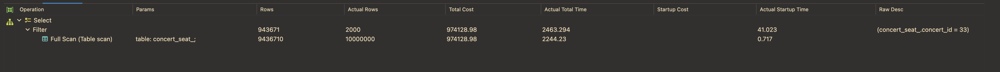
- 인덱스 설정한 후 
   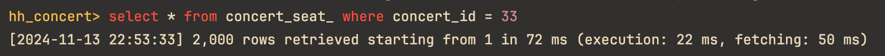
    explain analyze - actual time 약 8.9ms
    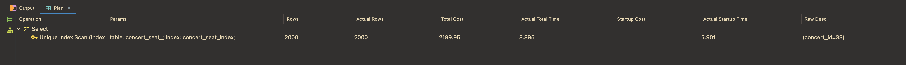

#### 3. 복합 인덱스 
- 좌석에 등급(VIP, S, R, A)이 있는 경우를 가정. 이 때 콘서트별 특정 좌석등급인 좌석들을 조회해오는 시나리오를 생각해 보겠다.
- 등급 컬럼 추가 및 좌석등급 데이터 랜덤으로 삽입  
    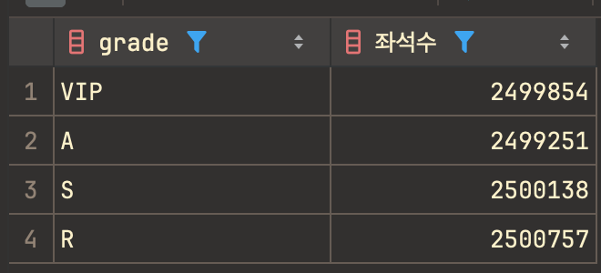
- 인덱스가 없는 경우 실행계획 : actual time 약 2.8s
    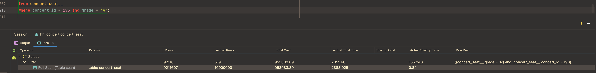
- concert_id, grade 각각 단일 인덱스 실행계획 : actual time 약 12ms 
    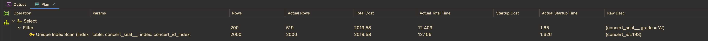
- 복합인덱스 실행계획 (concert_id, grade 순서) : actual time 약 5.9ms
    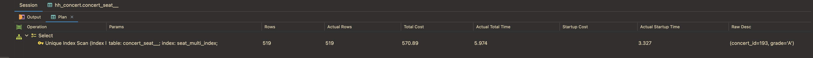
- 복합인덱스 실행계획 (grade, concert_id 순서) : actual time 약 8.6ms
    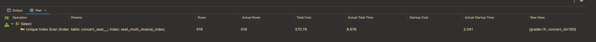
- 복합(concert_id, grade) - 복합(grade, concert_id) - 단일 - 인덱스x 순으로 조회속도가 빠르다.
<br/>

### 정리
| 적용지점  |적용컬럼| 성능향상                                                                                                             |
|-------|----|------------------------------------------------------------------------------------------------------------------|
| 콘서트조회 | title | 완전일치검색 : 향상(34s -> 0.3ms, 약 99.99% 향상) <br> like검색 : 의문(fulltext index적용시 41s -> 2.7ms, 약 99.93% 향상, but 불완전한검색) |
| 좌석조회(단일)| concert_id | 2.4s -> 8.9ms (약 99.63% 향상)                                                                                      |
| 좌석조회(복합)| concert_id, grade | 2.8s -> 5.9ms (약 99.82% 향상)                                                                                      |

