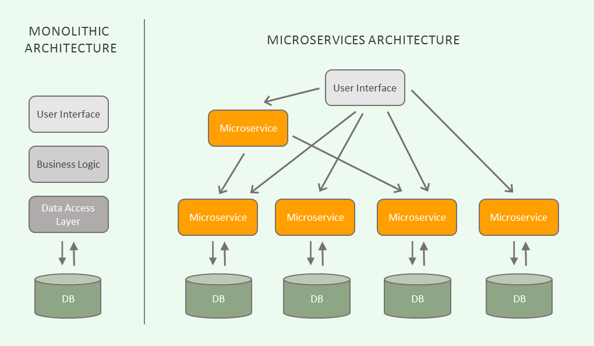
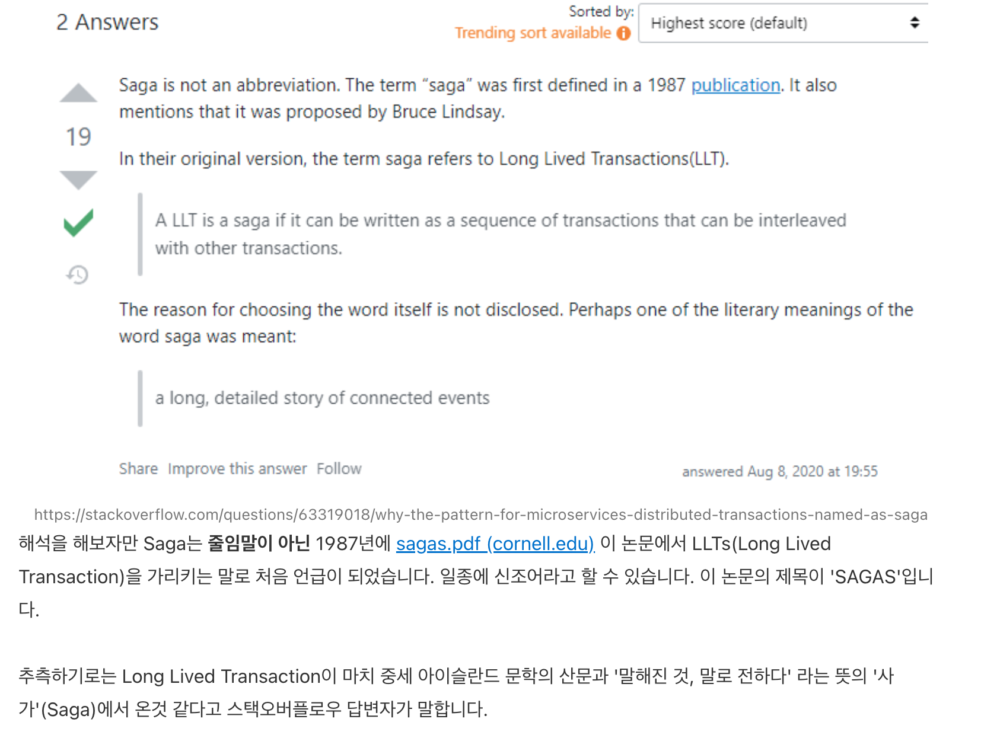
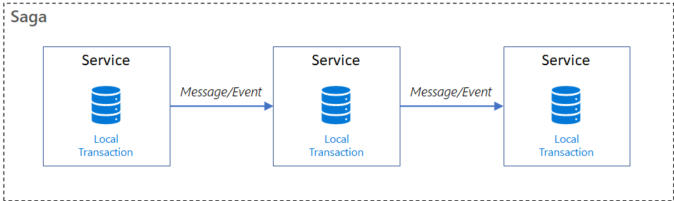
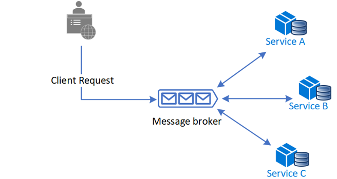
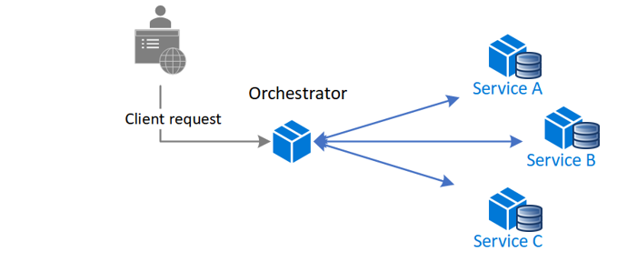
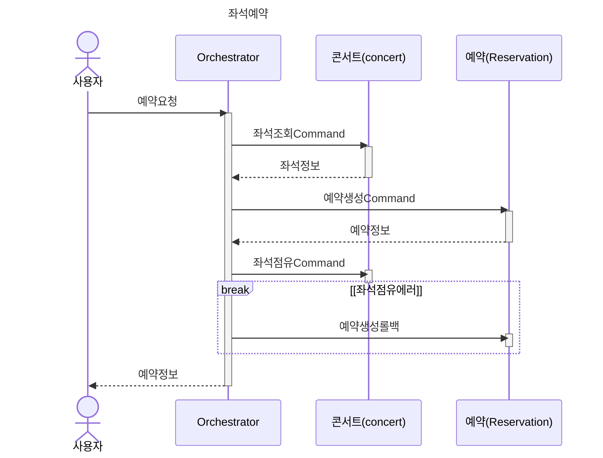
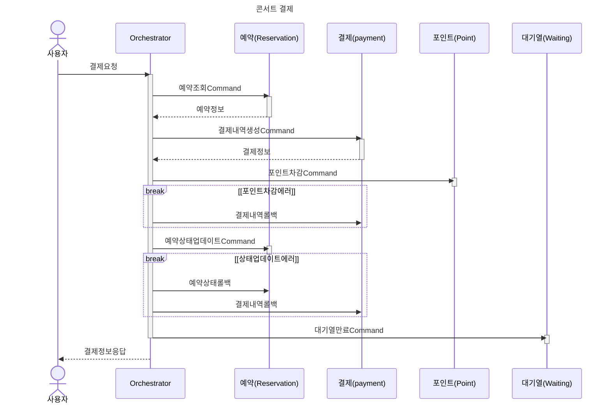

# MSA와 Saga패턴 이해하기

## Monolithic Architecture VS. Microservices Architecture(MSA)
현재 콘서트 예약 서비스 프로젝트는 모놀리식 아키텍처로 구현되어 있다. 모놀리식 아키텍처와 MSA는 무엇일까? 


### Monolithic Architecture
보통 `Mono`는 단일한 것을 뜻한다. 모놀리식 아키텍처는 **단일코드**로 작성되어 **단일 데이터베이스**에 연결된다. 따라서 구현이 쉽고, 복잡하지 않다.

#### 1. 장점
- 단순성: 모든 코드가 한 곳에 있다. 
- 간편한 배포: 단일 프로젝트만 배포하면 되므로 간편하다.
- 보편성: 대부분의 개발자가 경험하고 있는 구조이다.
- 유지보수(디버깅/테스트/모니터링) 용이: 단일 애플리케이션만 주목하면 된다. 

#### 2. 그러나 점점 규모가 커진다면?
- 전체 시스템 구조 파악이 어려움: 방대한 양의 코드를 파악하기 쉽지 않다.
- 빌드 시간 및 테스트, 배포 소요시간이 길어진다.
- 작은 수정사항에도 전체 프로젝트를 빌드, 배포해야한다.
- 모든 팀이 동일한 코드, 동일한 프로젝트에서 작업을 하므로 Merge Conflict 가능성이 높고, 타팀에게 미치는 사이드이펙트를 측정하기 힘들다.
- 기능별로 알맞은 기술, 언어, 프레임워크을 선택하기 까다롭고 특정 부분(기능)만 scale-out하기 어렵다.
- **일부분의 오류가 전체에 영향을 미칠 수 있다.** ex. 전체 서버 먹통
- 특히 **Transaction**의 범위가 넓은 경우, 정상적으로 시나리오가 흘러가더라도 관련도가 크지 않은 서비스의 오류때문에 전체 오류로 롤백 된다.
  - 예시코드 - 콘서트 결제의 경우
    ```java
    @Transactional
    void 콘서트_결제() {
        예약조회();
        결제내역생성();
        포인트차감();
        예약상태변경();
        대기열만료(); // 여기에서 에러가 날 경우 결제가 정상적으로 이루어졌음에도 결제오류가 반환된다.
    }
    ```

<br>

### Microservices Architecture(MSA)
`Microservices` 즉 서비스를 잘게 나누어 둔 구조를 의미한다. 모놀리식 아키텍처의 한계를 극복할 수 있다. 각 서비스가 서로 독립적이고, 각각의 데이터베이스를 가질 수 있다. 사용하는 언어도 다를 수 있다.
#### 1. 장점
- 개발자들이 각각의 서비스를 파악하고 개선하기에 용이하다. - 편리한 액세스
- 독립적인 배포로 전체 애플리케이션의 작동을 멈출 필요가 없다.
- 서비스별로 적합하게 기술스택을 사용할 수 있다.
- 특정 서비스에 오류가 나더라도 해당 서비스에만 영향을 주고 다른 서비스는 정상적으로 동작할 수 있다.

#### 2. 단점
- 테스트/디버깅 어려움: 테스트/디버깅을 위해 둘 이상의 애플리케이션을 실행해야 할 수도 있다.
- 모든 서비스를 모니터링하기 위해 중앙 모니터링 체계를 갖추는 등의 작업이 필요하다.
- 마이크로서비스간의 통신(동기/비동기)을 고려해야하므로 애플리케이션의 복잡성이 증가한다.
- 여러 서비스를 사용해 요청을 처리하는 경우, 오류 발생시 기존상태로 되돌려야 할지, 돌린다면 어떻게 되돌릴지를 고려해야한다. (하나의 트랜잭션으로 묶을 수 없으므로)

<br>

## 콘서트 시나리오 - MSA 분리계획
### 분리
서비스의 규모가 커지는 경우 기본적으로 현재 도메인 레이어에 나눠둔 구조를 바탕으로 각각의 서비스로 분리한다.
- 현재구조
    ```shell
    domain
      ├─concert
      ├─payment
      ├─point
      ├─reservation
      ├─user
      └─waiting
    ```
- concert / payment / point / reservation / user / waiting 으로 각각 서비스 분리

<br> 

### 트랜잭션 처리의 한계
Microservice 기반 분산된 아키텍처에서는 각 서비스가 서로 다른 데이터베이스를 가지고 있어 단순하게 ACID(Atomic, Consistent, Isolated, Durable) 트랜잭션을 유지하기 어렵다.

<br>

> **[ ACID ]**  
> 트랜잭션은 Atomic, Consistent, Isolated, Durable 해야한다. 단일 서비스에서 트랜잭션은 ACID하지만, 다중 서비스 아키텍처에서는 트랜잭션 관리 전략이 필요하다.  
> **Atomicity**: 원자성. 모든 작업이 성공하거나 모두 실패한다.   
> **Consistency**: 일관성. 트랜잭션 실행 후 성공적으로 완료하면 일관성있는 데이터베이스 상태를 유지한다.   
> **Isolation**: 고립성. 동시 트랜잭션이 발생해도 서로 방해하거나 영향을 미치지 않는다.  
> **Durability**: 영속성(내구성?). 시스템 장애나 정전이 발생하더라도 커밋된 트랜잭션이 커밋된 상태로 유지되도록 보장한다.

<br>
  
아래의 기존코드를 살펴보자.
```java
@Component
@RequiredArgsConstructor
public class ReservationFacade {

    private final ConcertService concertService;
    private final ReservationService reservationService;

    // 좌석예약
    @Transactional
    public ReservationInfo.ReservedInfo reserveSeat(ReservationCommand.ReserveSeat command) {
        long seatId = command.seatId();
        ConcertInfo.SeatInfo seatInfo = concertService.occupySeat(seatId); // 좌석 점유상태로 변경
        return reservationService.reserveSeat(seatInfo, command.userId()); // 예약데이터 생성
    }
}
```
`좌석예약`을 할 때에는 예약데이터의 생성과 좌석상태 변경이 하나의 트랜잭션 범위로 묶여야 한다. 예약데이터 생성이 실패하면 좌석의 점유상태는 `false`여야 하고, 예약데이터 생성이 성공하면 좌석의 점유상태는 `true`가 되어야하기 때문이다.
그러나 concert 도메인과 reservation 도메인을 각각의 서비스로 분리할 경우, 두가지 기능을 하나의 트랜잭션으로 묶어서 **원자성을 보장할 수 없게 된다.**  


<br>

## 해결방안: Saga 패턴 이해하기
위와 같은 트랜잭션 처리의 한계를 해결하기 위해 Saga 패턴에서는 `보상 트랜잭션`이라는 개념을 제시한다. Saga 패턴에 대해 이해해보자.

<br>

### Saga? 
우선 Saga라는 단어의 뜻은 무엇일까? 한 [블로그 글](https://krksap.tistory.com/2113)에서 힌트를 얻었다.  
<p align="center"><kbd></kbd></p>

이 글을 보고 나는 Saga 패턴은 `"구전설화 패턴"`이라고 이해했다(내마음대로). 이야기(Message)를 서비스간에 전달 전달 전달하는 패턴이니까.

Saga 패턴은 로컬 트랜잭션 순서를 이용한다. 각 로컬 트랜잭션이 데이터베이스를 업데이트하고, **메세지나 이벤트**를 발행해 다음 로컬 트랜잭션을 야기한다. 이 때 한 로컬 트랜잭션이 실패하는 경우, 앞서 진행된 트랜잭션들을 되돌리는(undo상태로) 일련의 **보상트랜잭션**(compensating transactions)을 발생시킨다.



> **[ 보상트랜잭션(compensatable transaction) ]**  
> 이미 진행된 다른 트랜잭션의 결과들을 반대로 되돌릴 수 있는 트랜잭션.  
> 
> **[ 피봇트랜잭션(pivot transaction) ]**  
> 사가의 진행/중단지점. 피봇 트랜잭션이 커밋되면 사가는 완료될 때까지 실행된다. 최종 보상트랜잭션 혹은 최초 재시도 가능 트랜잭션이 될 수 있다.
> 
> **[ 재시도 가능 트랜잭션(retryable transaction) ]**  
> 피봇 트랜잭션 이후 트랜잭션. 반드시 성공이 보장된다. 

<br>

### 접근법1. Choreography-Based-Saga
`Choreography`라는 단어를 보고 내가 떠올린 건 `안무`이다. 댄서들은 공연할 때 각자가 어떤 움직임을 할지 다 알고 있다. 이처럼 Choreography 기반 Saga는 중앙제어지점이 없다.
`Choreography`패턴은 event-driven한 메세지를 발행한다.  


#### 장점
1. 느슨한 결합도: 마이크로서비스들간의 결합도가 낮다. 
2. 유지보수 용이성: 마이크로서비스들이 각각 독립성을 유지하므로 시스템 유지보수가 쉽다.
3. 비동기적으로 동작하기 쉽다.

#### 단점
1. 분산되어 있으므로 테스트/모니터링이 어렵다.
2. 시스템을 전체적인 관점에서 바라보기 힘들다.
3. 순환의존의 위험이 있다. (ex. a -> b -> c -> a)

### 접근법2. Orchestration-Based-Saga
`Orchestration`이라는 단어를 보고 오케스트라를 떠올렸다. 오케스트라에는 지휘자가 있듯이 Orchestration방식에도 `Orchestrator`라는 중앙 컨트롤러가 있다.
`Orchestration`은 command-driven한 메세지를 발행한다.  


#### 장점
1. 중앙제어: 서비스들 간의 상호작용을 모니터링하기 쉽다. 
2. 단일의존: 각 서비스들이 Orchestrator만 쳐다보고 있으면 된다. 
3. 관심사분리: 참여서비스들이 다른 서비스의 명령을 몰라도 된다. 

#### 단점
1. 새 로직 추가하기 복잡하다. 
2. 장애지점이 하나 더 생긴다. 

> **Event vs. Command 내맘대로 정리** [참고링크](https://camunda.com/blog/2023/02/orchestration-vs-choreography/)
> 
> Event: 이벤트는 과거에 이미 발생했고 이미 사실이다. "지금 이런 일이 일어났어."  
> Command: 명령. "앞으로 이거해." 

<br>

## Saga 패턴을 적용한 콘서트 예약서비스 설계




<br>

## 정리
- Monolithic으로 시작했으나 서비스 규모가 커지면 MSA로 분리해보자.
- 트랜잭션 원자성 문제 -> Saga 패턴으로 해결해 보자.

<br>

> 참고  
> [모놀리식 vs 마이크로서비스, 어떤 아키텍처를 선택할까?](https://yozm.wishket.com/magazine/detail/1813/)  
> [모놀리식 아키텍처 vs 마이크로서비스](https://velog.io/@ragnarok_code/%EB%AA%A8%EB%86%80%EB%A6%AC%EC%8B%9D-%EC%95%84%ED%82%A4%ED%85%8D%EC%B2%98-vs-%EB%A7%88%EC%9D%B4%ED%81%AC%EB%A1%9C%EC%84%9C%EB%B9%84%EC%8A%A4)  
> [Saga distributed transactions pattern](https://learn.microsoft.com/en-us/azure/architecture/reference-architectures/saga/saga)  
> [마이크로 서비스 아키텍처(MSA, MicroService Architecture)란?](https://mangkyu.tistory.com/108)  
> [[Saga 패턴] 마이크로서비스에서 Saga 패턴이란?](https://joobly.tistory.com/69)  
> [Saga Pattern에서 Saga의 뜻](https://krksap.tistory.com/2113)  
> [12가지 디자인 패턴으로 알아보는 클라우드 네이티브 마이크로서비스 아키텍처](https://www.youtube.com/watch?v=8OFTB57G9IU)  
> [Choreography pattern](https://learn.microsoft.com/en-us/azure/architecture/patterns/choreography)  
> [Orchestration vs Choreography](https://camunda.com/blog/2023/02/orchestration-vs-choreography/)
