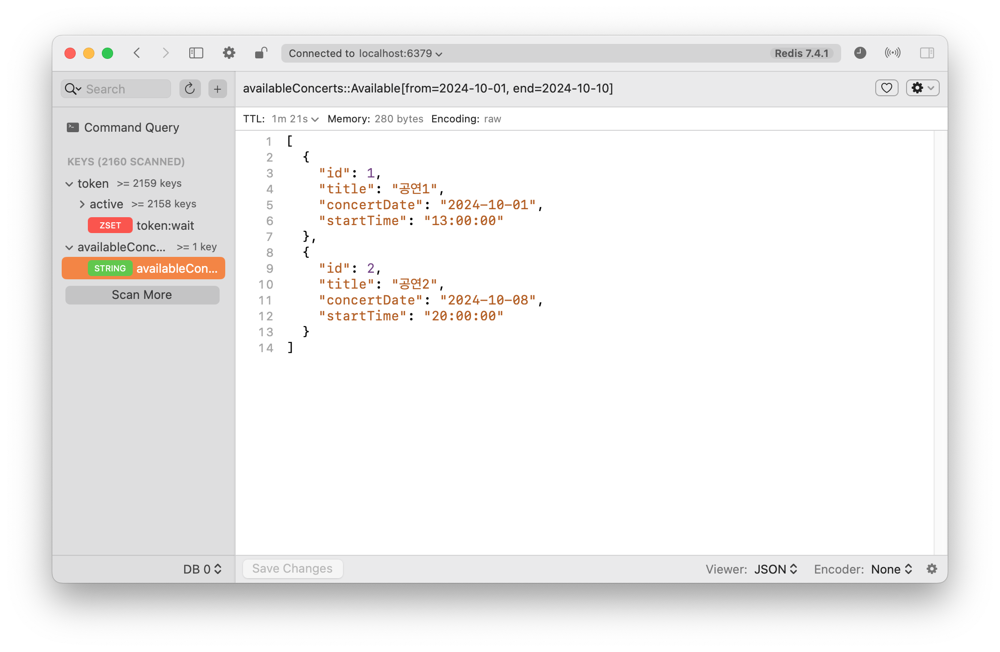
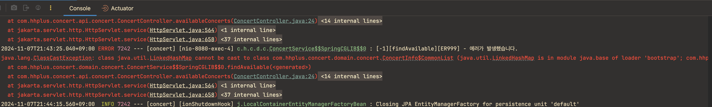

## 캐싱 정리 및 적용기

### [ Cache ]
- 한 번 처리한 데이터를 임시 저장하는 것. 비슷한 요청이 왔을 때 DB가 아닌 캐시에서 데이터를 읽어 성능 및 응답속도를 향상시키고자 함.
  - DB는 HDD이다. : HDD( 하드 디스크 드라이브 )는 SSD( 솔리드 스테이트 드라이브 )보다 속도가 느리다.
- 캐싱은 원본 데이터와는 별개로 자주 사용되는 데이터(Hot Data)들을 복사해둘 캐시공간을 마련함. 
  - 훨씬 빠르게 접근 가능한 곳을 주로 사용한다.
- Cache hit: 캐시에 원하는 데이터가 있으면 원본(DB)이 아닌 캐시에서 바로 해당 데이터 제공.

<br/>

### [ 캐싱 전략 ]
1. Look aside Cache(Lazy Loading)
    - 캐시에 데이터 있는 경우 캐시호출. 
    - 캐시서버(Redis)가 다운되더라도 DB에서 데이터를 가지고 올 수 있다.
   
2. Write Back
   - 쓰기가 빈번할 때 사용.
   - DB보다 Cache에 먼저 데이터 저장 > 특정 시점에 DB로 데이터를 밀어넣어준다.
     - ex. 게임 경험치
   
   1. Write-Around
      - 캐시를 거치지 않고 무조건 DB에 저장
      - Cache miss 의 경우에만 DB에서 데이터 조회
      - DB에 발생한 변화가 조회에는 적용 안될 수 있음.
      
   2. Write-Through
      - DB에 데이터를 저장할 때 캐시에도 같이 저장함.
      - 캐시도 항상 최신 데이터이지만 저장이 2번일어나는 단점이 있다.

<br/>

### [ Redis와 캐시 ]
- Redis도 저장소다. 속도가 빠름
- Redis의 컬렉션은 원자성을 보장하기 때문에 자원 경쟁을 피할 수 있어 트랜잭션 경합의 영향을 덜 받는다. 

- 대표자료구조

| 타입         | 특징                                                             |
|------------|----------------------------------------------------------------|
| Strings    | 제일 기본. **캐싱용도**로 자주 사용된다                                       |
| Lists      | 데이터 순서대로 저장. Linked List. Queue 나 Stack처럼 쓸 수 있다.              |
| Hashes     | field-value 쌍.                                                 |
| Set        | 정렬되지 않은 유니크값들의 collection                                      |
| Sorted Set | Set과 마찬가지로 유니크한 값들의 collection이다. 그리고 score라는 double값으로 정렬해준다. |

<br/>

### [ 콘서트 프로젝트 적용지점 ]
캐싱은 데이터를 저장할 때 쓰게 된다면 추후 DB데이터와 정합성을 맞추는 이슈가 발생할 수 있으므로 많은 고민이 필요하다.  
반면 데이터 조회 시에는 조회 해올 데이터가 변동이 적고, 비슷한 조건으로 조회해오는 경우가 많다면 캐싱처리를 통해 성능을 개선할 수 있다.  
현재 진행중인 콘서트 프로젝트에서는 `예약가능한 날짜 조회` api에서 적용할 수 있다.

예약 가능한 날짜 조회는 대기열을 통과해온 모든 사용자가 대부분 비슷한 시각에 비슷한 조건으로 조회를 하게 될 것이다. -> 다량의 조회 발생   
또한 예매도중(특히 막 오픈한 시점)에 정보가 바뀔 가능성이 현저히 적다. -> 캐싱 데이터와 DB 데이터가 같을 것이다.
따라서 `예약가능한 날짜 조회` 시에 캐싱을 적용하고자 한다.

<br/>

### [ 캐싱 적용하며 맞닥뜨린 문제 ]
첫번째 조회시 캐싱은 되지만 그 이후 조회 시에는 캐싱된 데이터를 받아오지 못하는 이슈 발생했다. 

위 이미지를 보면 알 수 있듯이 정상적으로 데이터가 레디스 쪽으로 들어온 것은 확인하였다. 그러나 저장된 이후 다시 postman으로 요청을 날리면 아래와 같은 오류가 발생했다.

에러메시지를 보니 캐싱데이터를 레디스는 줬지만, 뭔가 자바 코드쪽에서 역직렬화가 안되고 있는 듯 했다. 

<br/>

### [ 문제가 되었던 코드 ]
레디스 설정이 문제인가? 등등 많은 삽질을 거친 끝에, 아래 코드가 문제인 것을 발견했다.
```java
    @Cacheable(key = "#command", value = "availableConcerts")
    public List<ConcertInfo.Common> findAvailable(ConcertCommand.Available command) {
        List<ConcertEntity> concerts = concertRepository.findAvailable(command.from(), command.end());
        return concerts.stream().map(ConcertInfo.Common::of).toList(); // 수정 전 코드
    }
```
맨 아래 `return concerts.stream().map(ConcertInfo.Common::of).toList();`로 작성하였으나, toList()로 할 경우 수정불가능한 List로 반환이 된다.   
그래서 역직렬화가 안되었던듯 하다. 아래와 같이 `.collect(Collectors.toList())`로 수정 후에는 정상적으로 작동하였다.
```java
    @Cacheable(key = "#command", value = "availableConcerts")
    public List<ConcertInfo.Common> findAvailable(ConcertCommand.Available command) {
        List<ConcertEntity> concerts = concertRepository.findAvailable(command.from(), command.end());
        return concerts.stream().map(ConcertInfo.Common::of).collect(Collectors.toList()); // 수정 후 코드
    }
```

<br/>

#### 참고
- https://velog.io/@hwsa1004/Spring-Redis-Cache%EB%A5%BC-%ED%86%B5%ED%95%B4-%EC%84%B1%EB%8A%A5-%EA%B0%9C%EC%84%A0%ED%95%98%EA%B8%B0  
- https://velog.io/@kim_table_next/Spring-%EC%BA%90%EC%8B%9CCache-QueryDSL  
- [Redis Docs](https://redis.io/docs/latest/develop/data-types/sorted-sets/)
- [Collectors.toList() vs Stream.toList()](https://velog.io/@cieroyou/Stream%EC%9D%84-List%EB%A1%9C-%EB%B3%80%ED%99%98%ED%95%98%EB%8A%94-%EB%8B%A4%EC%96%91%ED%95%9C-%EB%B0%A9%EB%B2%95%EA%B3%BC-%EC%B0%A8%EC%9D%B4Collectors.toList-vs-Stream.toList)
