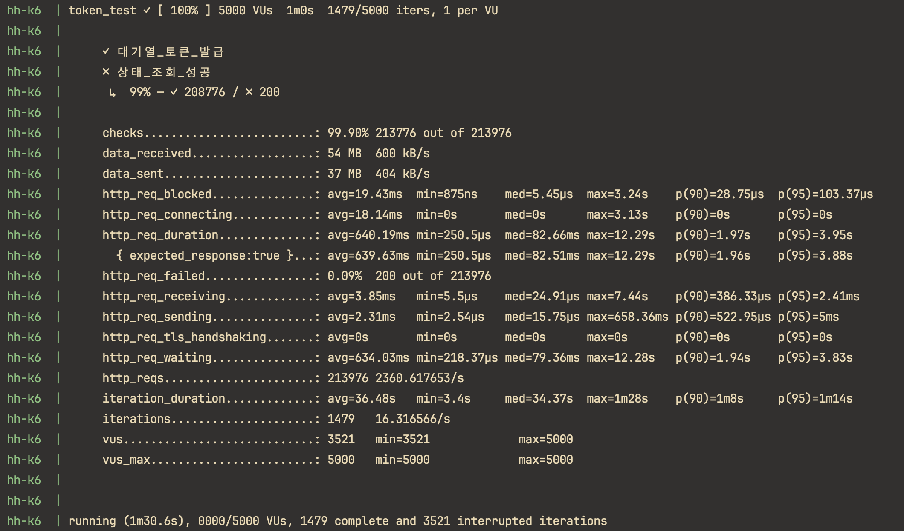
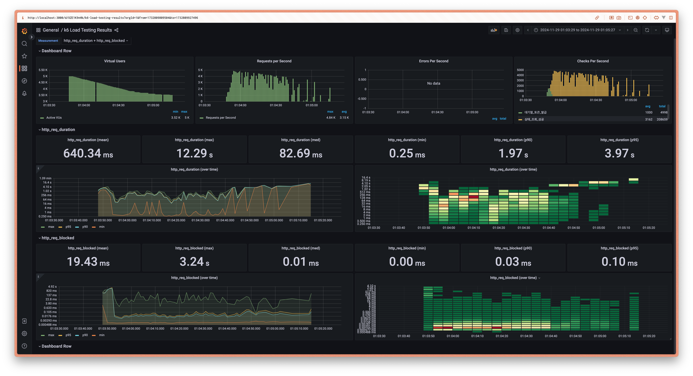
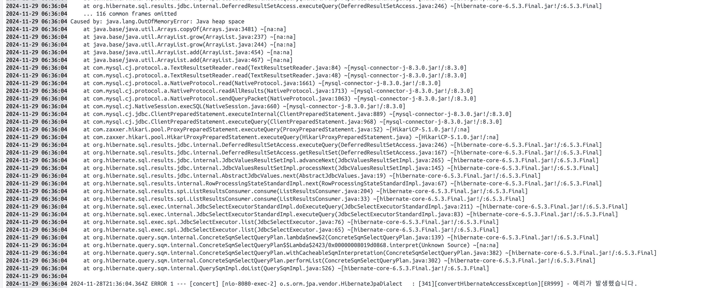
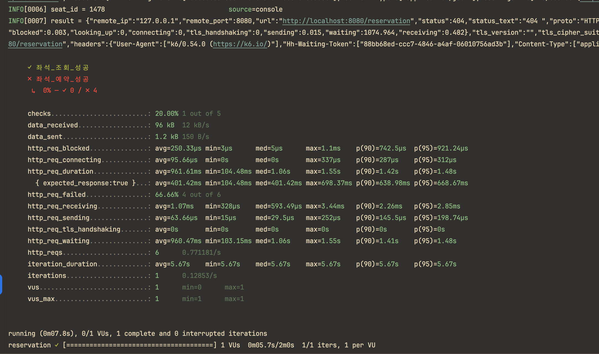

# 장애대응 및 부하테스트

## 테스트 설정
- 테스트도구 : k6
- 모니터링 도구 : grafana + influxDB
- docker 배포 후 테스트

## 테스트 시나리오
### [ 대기열 토큰 발급 ~ 상태조회 ]
#### 1. 시나리오 옵션
```javascript
export let options = {
  scenarios: {
    token_test: {
      exec: 'tokenTest',
      executor: 'per-vu-iterations', // 각 vu가 iteration만큼 활동
      vus: 5000,
      iterations: 1,
      maxDuration: '3m',
    },
  }
}
```
- executor: **per-vu-iterations** 
  - 각 vu가 정해진 반복횟수를 정확히 실행한다.
- vus: 5000 / iterations: 1
  - 5000명의 사용자가 정의된 메서드 _(exec: 'tokenTest')_ 를 1회 실행
  
<br/>

#### 2. 실행 스크립트
```javascript
export function tokenTest() {
  let token = issueToken();
  if (token) {
    pollingToken(token);
  }
}


export function issueToken() {
  let option = {
    headers: {
      Connection: 'keep-alive',
    },
  }
  const res = http.post('http://concert-app:8080/waiting',null,option);

  const issued = check(res, {
    '대기열_토큰_발급': (r) => r.status === 200,
  });

  if (issued) {
    return res.json().token;
  }
  return false;
}

export function pollingToken(token) {
  console.log(token);
  let waiting = true;
  let option = {
    headers: {
      Connection: 'keep-alive',
      'Hh-Waiting-Token': token,
    },
  };
  
  // 상태 확인 요청 반복
  while (waiting) {
    sleep(1)
    const res = http.get('http://concert-app:8080/waiting', option);

    // 상태 확인
    const success = check(res, {
      '상태_조회_성공': (r) => r.status === 200,
    });

    if (success) {
      const resJson = res.json();
      waiting = resJson.status !== 'ACTIVE';
    } else {
      return ;
    }
  }
}
```
- **issueToken()**
  - 대기열 토큰 발급 api 요청.
  - vu당 1회만 요청함.
  - 요청 성공 시 토큰값 반환
- **pollingToken(token)**
  - 대기열 토큰 상태조회 api 요청
  - 토큰 상태가 활성(ACTIVE)상태 인 경우 vu는 요청을 종료함.
  - vu당 0~무한 요청.
    - 0: 토큰 발급 실패한 경우
    - 무한: 시간 내 활성화 되지 못한 경우

<br/>

#### 3. 실행 결과 
- k6 결과
<p align="center"><kbd></kbd></p>
- 그라파나 대시보드
<p align="center"><kbd></kbd></p>  

```
1. 총 213,976건의 요청 중 213,776건 성공
2. 상태 조회 요청에서 200건 실패
3. 요청-응답 평균 시간 640.19ms, 최대 12.29s
4. 초당 평균 요청수(RPS) - 2360.6 RPS
```

### [ 좌석예약 ~ 결제 ]
#### 1. 시나리오 옵션
```javascript
export let options = {
  scenarios: {
    reservation: {
      exec: 'reservation',
      executor: 'per-vu-iterations', // 각 vu가 iteration만큼 활동
      vus: 2500,
      iterations: 1,
      maxDuration: '2m',
    },
  }
}
```
- executor: **per-vu-iterations**
  - 각 vu가 정해진 반복횟수를 정확히 실행한다.
- vus: 2500 / iterations: 1
  - 2500명의 사용자가 정의된 메서드 _(exec: 'reservation')_ 를 1회 실행

<br/>

#### 2. 실행 스크립트
```javascript
export function setup() {
  const res = http.post('http://localhost:8080/waiting');
  let token = res.json().token;
  console.log(token);
  sleep(2)
  let header = {
    headers: {
      'Hh-Waiting-Token': token,
    },
  };
  return { header };
}

function getRandomSeatId() {
  return Math.floor(Math.random() * 2000) + 1;
}

export function reservation(data) {
  console.log('예약 시작..')
  const { header } = data;
  const baseUrl = 'http://localhost:8080'

  // 1. 좌석조회
  const res = http.get(`${baseUrl}/concerts/1`,header);
  let success = check(res, {
    '좌석_조회_성공': (r) => r.status === 200,
  });
  if (!success) return ;


  // 2. 좌석예약 (최대 4번 시도)
  let trial = 0; // 시도 횟수
  const maxTrial = 4; // 최대 시도 횟수
  success = false;

  console.log(__VU);
  while (trial < maxTrial && !success) {
    trial++;
    const reserv_body = {
      seat_id: getRandomSeatId(),
      user_id: __VU,
    }
    
    header['headers']['Content-Type'] = 'application/json'
    const res2 = http.post(`${baseUrl}/reservation`,JSON.stringify(reserv_body), header);
    let res2Json = JSON.stringify(res2);
    success = check(res2, {
      '좌석_예약_성공': (r) => r.status === 200,
    });
  }
  if (!success) return ;


  // 3. 결제
  const pay_body = {
    reservation_id: res2.json()['reservationId']
  }
  const res3 = http.post(`${baseUrl}/payment`,pay_body, header);
  check(res3, {
    '결제_성공': (r) => r.status === 200,
  });
};

```
- setup() 
  - 데이터 세팅: 대기열 토큰 발급 
- getRandomSeatId()
  - 랜덤좌석번호 배정
- reservation(data) 
  - setup()에서 세팅한 데이터를 받아 시나리오 진행
  - 좌석조회 > 좌석예약(최대 4번) > 결제
  - __VU: vu가 가지는 고유 id. 여기서는 user_id처럼 쓴다.

<br/>

#### 3. 실행과 오류보고
오류1. 좌석 조회 실패
- *부제: 모두 끝나버렸다... 난 시작도 안해봤는데..*

- 테스트 실행 시 좌석조회에서 단 한건도 성공하지 못한채로 실패.
- 로그를 확인해 보니 OutOfMemoryError, 혹은 connection pool 에러 등이 나고 있었음.
  <p align="center"><kbd></kbd></p>

  - 오류원인 : 좌석조회 쿼리 조회 시 좌석이 한번에 5,000,000석 조회되고 있었음. -> 쿼리 한번에 약 40초 소요.
  - 해결방안 :
    - 테스트 진행을 위한 임시조치: 쿼리에 limit 0, 2000으로 쿼리 수정  
      ```java
        public interface ConcertSeatsJpaRepository extends JpaRepository<ConcertSeatEntity, Long> {

        @Query("select s from ConcertSeatEntity s where s.concertId =:concertId order by s.id limit 2000")
        List<ConcertSeatEntity> findAllByConcertId(@Param("concertId") long concertId);
      
      }
      ```
  - 추후 장기적 해결방안: 콘서트장 구역별 좌석 조회(구역컬럼 추가)하도록 수정 필요 
    - 콘서트 도메인임을 고려하여 페이징 처리보다는 구역별 좌석조회를 진행하고자 함.

<br/>

오류2. 좌석 예약 실패
<p align="center"><kbd></kbd></p>
- 실패원인: 좌석 예약을 위한 좌석 조회 시 null 반환함. 그러나 DB에서 직접 쿼리로 조회하면 좌석데이터 있음. 
  <p align="center"><kbd></kbd></p>
- 현재 정확한 오류원인 파악중. 파악이후 조치예정.

